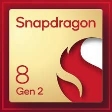

  

<h1 align="center">Kailua Development</h1>
<h3 align="center">Bringing Qualcomm Kalama Platform to Life</h3>

<h2 align="center">Supported Devices</h2>

<table>
  <tr align="center">
    <th>Device</th>
    <th>Project</th>
    <th>Status</th>
    <th>Maintainers & Contributors</th>
  </tr>
  <tr align="center">
    <td><a href="https://github.com/Kailua-Development/android_device_qcom_kalama">Kalama for arm64</a></td>
    <td>AOSP/Project Kailua</td>
    <td>Work in Progress</td>
    <td>uwugl, Littlenine, EdwardWu</td>
  </tr>
</table>

